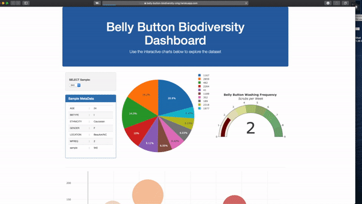
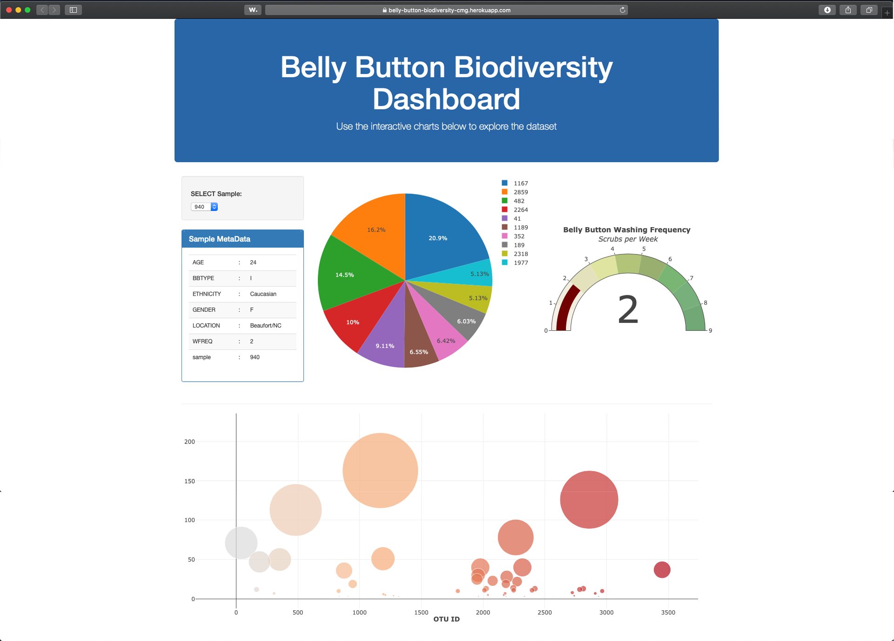

# Project Javascript

## Project Description
The goal of the project was to use create an app and deploy it to `Heroku` (Cloud Application Platform).
The app runs a `Flask` server that renders the `index.html` file. The `Javascript` code queries an `sqlite` database, create a chart and plot the data ussing `D3` and `Plottly` libraries.
- The app deployed in Heroku can be found in the link below:
`https://belly-button-biodiversity-cmg.herokuapp.com`

### App Running 

### Sample app Screenshot

 

## Instructions

### Offline
#### Requirements 
Install dependencies in your Python enviroment as described below:
- pip install gunicorn
- pip install psycopg2
- pip install flask
- pip install flask-sqlalchemy
- pip install pandas

#### Steps
1. - Run the `app.py` file with Python which create a development server.
2. - While the `app.py` file is running open the route `http://127.0.0.1:5000/`or the one created by running the app.

### Online
Click the link below or type it in your web browser
- `https://belly-button-biodiversity-cmg.herokuapp.com`

# File Description
### - `javascript-challenge/`
#### - `UFO-Level-1`
- Contains the files to run the `Level-1`part of the project.+
##### - index.html
- It contains the HTML code necessary to interact with the final user.
- The index file references and uses `.css`, `.js` code contain in the `UFO-Level-1/static` folder.
##### - `css` 
###### - `style.css`
- It contains all the necessary information to format the `UFO-Level-1/index.html`file.
##### - `images` 
###### - `nasa.jpg`
- It contains a photo of mars from the www.nasa.com website and it is used in the `UFO-Level-1/index.html`file.
###### - `ufo.svg`
- It contains an `.sgv` file with the website logo used in the `UFO-Level-1/index.html`file.
##### - `js` 
###### - `app.js`
- It contains the Javascript code that interacts with the final user and shows the data used in the `UFO-Level-1/index.html`file.
###### - `data.js`
- It contains the UFO Sightings data filtered and displayed in the `UFO-Level-1/index.html`file.
#### - `UFO-Level-2`
- Contains the files to run the `Level-2`part of the project.
- All the files and folders are the same than for the `UFO-Level-1`folder.
#### - `UFO-Level-3`
- Contains the files to run the `Level-3`part of the project.
- All the files and folders are the same than for the `UFO-Level-1`folder.
#### - `Web-Samples`
- It contains sample images of the website.
